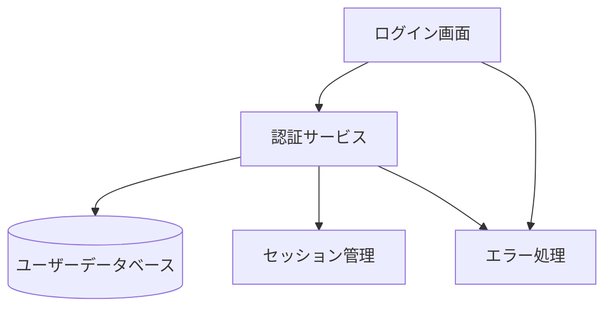
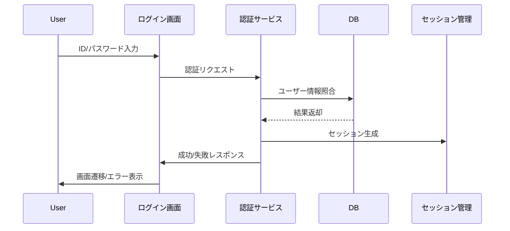

# Design Document
---
**Purpose**: 本設計書はパスワード認証機能とログイン後画面の実装一貫性を担保するための技術設計を示します。
---

## Overview
## 追加設計詳細（レビュー指摘対応）

### セッション管理のセキュリティ属性の具体性
Cookieには以下の属性を必須とする：
- `HttpOnly`: JavaScriptからのアクセス不可（XSS対策）
- `SameSite=Strict`: クロスサイトリクエスト対策
- 有効期限: 30分（認証後30分間操作がなければ自動失効）
運用例：Expressの`res.cookie()`で上記属性を全て指定。セッションIDはランダム生成し、DBには保存しない。

### エラー型・エラー処理の詳細設計
エラー型はTypeScriptで以下のように定義：
```typescript
type AuthError =
  | { type: 'ValidationError'; message: string }
  | { type: 'AuthFailed'; message: string }
  | { type: 'Locked'; message: string }
  | { type: 'SystemError'; message: string };
```
APIレスポンス例：
```json
{
  "success": false,
  "error": { "type": "AuthFailed", "message": "IDまたはパスワードが不正です" }
}
```
UIはtypeに応じて表示内容を切り替える。バックエンドは全て型安全なDTOで返却。

### 要件トレーサビリティの具体化（3.2/3.3）
障害時エラー表示（3.2）：
- バックエンドで例外発生時は`SystemError`型で返却し、UIは「システム障害が発生しました。時間をおいて再度お試しください」と表示。
パスワード保存禁止（3.3）：
- MongoDBのユーザースキーマ例：
```js
{
  userId: String,
  passwordHash: String, // 平文保存禁止
  loginAttempts: Number,
  locked: Boolean
}
```
`passwordHash`のみ保存し、平文は一切保持しない。保存前にbcrypt等でハッシュ化。
本機能はユーザーがIDとパスワードで安全に認証し、認証後に専用画面へ遷移できる仕組みを提供します。主な利用者は一般ユーザーであり、認証失敗時のエラー表示やセキュリティ対策も含みます。

### Goals
- ユーザー認証の安全性・利便性の両立
- 認証後画面への正確な遷移
- セキュリティリスクの最小化

### Non-Goals
- ソーシャルログイン連携
- パスワードリセット機能
- 多要素認証
- テスト

## Architecture

### Architecture Pattern & Boundary Map

- 選択パターン: MVC+サービス分離
- 境界: UI/認証/データ/セッション/エラー
- 新規コンポーネント: 認証サービス、セッション管理
- Steering遵守: パスワード平文保存禁止、型安全

## Technology Stack
| Layer                | Choice / Version | Role in Feature         | Notes                |
|----------------------|------------------|------------------------|----------------------|
| Frontend             | React 18         | ログイン画面           | UI標準準拠           |
| Backend / Services   | Node.js 20       | 認証サービス           | Express利用           |
| Data / Storage       | Mongo 8    | ユーザー情報保存       | パスワードはハッシュ化|
| Session Management   | Cookie           | 認証後状態保持         | セキュリティ属性必須  |

## System Flows


## Requirements Traceability
| Requirement | Summary | Components | Interfaces | Flows |
|-------------|---------|------------|------------|-------|
| 1.1 | ログイン入力検証 | AuthService, UI | /login API | 認証シーケンス |
| 1.2 | 不正時エラー表示 | AuthService, UI | /login API | 認証シーケンス |
| 1.3 | 空欄時エラー表示 | AuthService, UI | /login API | 認証シーケンス |
| 1.4 | 試行回数記録     | AuthService, DB | /login API | 認証シーケンス |
| 2.1 | 認証成功遷移     | AuthService, UI, Sess | /login, /home | 認証シーケンス |
| 2.2 | ユーザー名表示   | UI, DB | /home API | 認証後画面 |
| 2.3 | セッション切れ対応| AuthService, UI, Sess | /login API | 認証シーケンス |
| 3.1 | アカウントロック | AuthService, DB | /login API | 認証シーケンス |
| 3.2 | 障害時エラー表示 | AuthService, UI | /login API | 認証シーケンス |
| 3.3 | パスワード保存禁止| AuthService, DB | DB層 | なし |

## Components and Interfaces
| Component      | Domain/Layer | Intent                | Req Coverage      | Key Dependencies | Contracts |
|----------------|-------------|-----------------------|-------------------|------------------|-----------|
| UI             | Frontend    | ログイン/エラー表示   | 1.1,1.2,1.3,2.1,2.2,2.3 | React, /login API | Props, API |
| AuthService    | Backend     | 認証・試行管理        | 1.1-1.4,2.1,2.3,3.1-3.3 | Express, DB, Sess | REST, DB |
| DB             | Data        | ユーザー情報管理      | 1.1,1.4,2.2,3.1,3.3 | MongoDB | SQL |
| Session        | Backend     | セッション管理        | 2.1,2.3           | Cookie           | REST |
| Error          | Backend/UI  | エラー表示            | 1.2,1.3,2.3,3.2   | -                | Props |

### Component Details
- **UI**: Reactでログインフォーム・エラー表示・ユーザー名表示。Props型明示。
- **AuthService**: Expressで認証API。ID/パスワード検証、試行回数管理、ロック判定。型安全なDTO/レスポンス設計。
- **DB**: MongoDB。ユーザー情報はID/ハッシュ化パスワード/試行回数/ロック状態を持つ。
- **Session**: Cookieでセッション管理。有効期限・セキュリティ属性（HttpOnly, Secure）必須。
- **Error**: UI/バックエンドでエラー表示。エラー型は明示的に定義。

---
