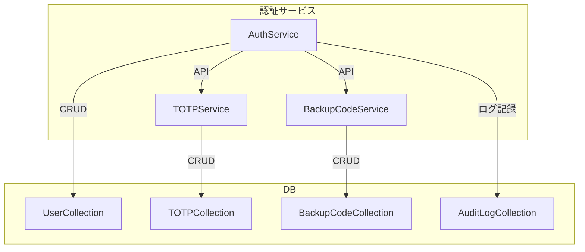

# デザインドキュメント

---
**目的**: TOTPによる2要素認証機能を既存認証基盤に拡張し、セキュリティ・可用性・運用性を向上させる。

---

## 概要
本機能は、ユーザーアカウントにTOTP認証を追加し、ログイン時に2要素認証を必須化します。TOTPシークレット生成・QR表示・認証検証・バックアップコード・リカバリ・管理監査までを一貫して提供します。

### ゴール
- TOTPセットアップ・認証・リカバリ・監査の全フローを安全に実装
- TypeScript型安全・MVC分離・拡張性確保
- 既存authServiceとのAPI連携

### 非ゴール
- SMS/メールOTP等、TOTP以外の認証方式
- 管理画面UIの詳細設計
- 外部ID連携

## アーキテクチャ

### 既存アーキテクチャ分析
- 認証機能は `src/auth/authService.ts` に集約
- MVC分離・サービス/モデル/DTOパターン
- MongoDBによるユーザー情報管理

### アーキテクチャパターン & 境界図


### 技術スタック & アラインメント
- Node.js 20 + Express
- TypeScript（型安全・DTO設計）
- MongoDB（TOTP/バックアップコード/監査ログ管理）
- speakeasy/otplib（TOTP生成・検証）
- qrcode（QRコード生成）

## コンポーネント & インターフェース契約

### TOTPService
- TOTPシークレット生成・検証・QRコード生成
- インターフェース:
  - `generateSecret(userId: string): TOTPSecretDTO`
  - `verifyCode(userId: string, code: string): boolean`
  - `getQRCode(secret: string): string`

### BackupCodeService
- バックアップコード生成・検証・無効化
- インターフェース:
  - `generateCodes(userId: string): BackupCodeDTO[]`
  - `verifyCode(userId: string, code: string): boolean`
  - `invalidateCode(userId: string, code: string): void`

### AuditLogService
- TOTP関連イベントの記録・取得
- インターフェース:
  - `logEvent(userId: string, event: string, detail?: string): void`
  - `getEvents(userId: string): AuditEventDTO[]`

### AuthService（既存拡張）
- TOTP認証フロー統合
- インターフェース:
  - `loginWithTOTP(userId: string, password: string, totpCode: string): AuthResultDTO`

## データモデル

### TOTPSecretDTO
```typescript
type TOTPSecretDTO = {
  userId: string;
  secret: string;
  createdAt: Date;
  verified: boolean;
}
```

### BackupCodeDTO
```typescript
type BackupCodeDTO = {
  userId: string;
  codeHash: string;
  used: boolean;
  createdAt: Date;
}
```

### AuditEventDTO
```typescript
type AuditEventDTO = {
  userId: string;
  event: string;
  detail?: string;
  timestamp: Date;
}
```

### AuthResultDTO
```typescript
type AuthResultDTO = {
  success: boolean;
  error?: string;
  sessionId?: string;
}
```

## 要件トレーサビリティ
- 1.1, 1.2, 1.3 → TOTPService, QR生成, DB保存, エラー処理
- 2.1, 2.2, 2.3, 2.4 → AuthService, TOTPService, ロック処理
- 3.1, 3.2, 3.3 → BackupCodeService, 本人確認API, AuditLogService
- 4.1, 4.2 → AuditLogService, 管理API

## リスク・課題
- TOTPシークレット・バックアップコードの安全な保存・漏洩対策
- 本人確認フローのUX・セキュリティ
- 既存認証とのAPI連携・型整合性

## 参考: 詳細調査・意思決定は research.md を参照
