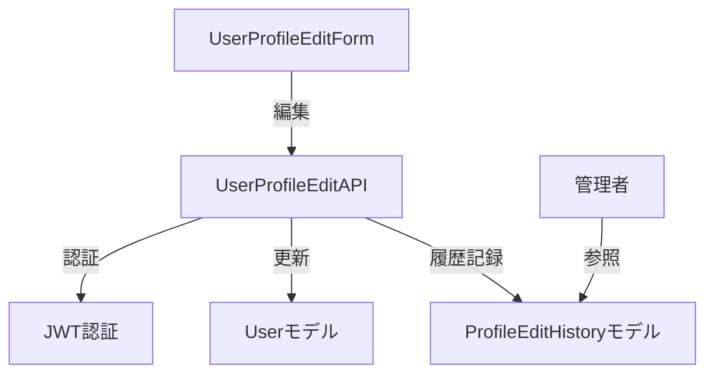

# ユーザー情報編集機能 技術設計書

---
**目的**: ユーザーが自身のプロフィール情報（氏名、メールアドレス、パスワード等）を安全に編集できる機能を追加する。型安全・認証・履歴管理を重視し、既存MVC構成に準拠する。

## 概要
本機能は既存のユーザー管理・認証基盤（authService, Userモデル）を拡張し、ユーザー自身によるプロフィール編集と変更履歴の監査を可能にします。編集APIはJWT認証を必須とし、履歴管理は専用モデルで実装します。

### ゴール
- ユーザーが自身のプロフィール情報を編集できる
- 編集APIは認証・本人確認を必須とする
- 変更履歴を記録し管理者が参照可能

### 非ゴール
- 他ユーザーの情報編集
- 履歴の外部連携・通知
- パスワードリセット機能（別要件）

## アーキテクチャ

### 既存アーキテクチャ分析
- MVC構成（React + Express + MongoDB）
- ユーザー管理はauthService.ts, User.tsで実装
- プロフィール表示はUserProfile.tsx

### アーキテクチャパターン・境界図


### 技術スタック・整合性
- フロント: React 18, TypeScript
- バックエンド: Node.js 20, Express
- DB: MongoDB（User, ProfileEditHistory）
- 認証: JWTトークン

## コンポーネント & インターフェース契約

### 1. UserProfileEditForm (React)
- Props: user: IUser
- Events: onSave(profile: { username: string; email: string; password?: string })
- バリデーション: フロント側で型安全チェック

### 2. UserProfileEditAPI (Express)
- POST /api/profile/edit
- Request: { username, email, password } + JWTトークン
- Response: { success: boolean; error?: string }
- 認証: JWTトークン検証
- 本人確認: リクエストユーザーIDと編集対象ID一致必須
- エラーハンドリング: 型安全なDTO, discriminated union

### 3. Userモデル (MongoDB/TypeScript)
- フィールド: username, email, password, ...
- メソッド: updateProfile, validateProfile

### 4. ProfileEditHistoryモデル
- フィールド: userId, before, after, editedAt
- メソッド: createHistory, getHistoryByUser

### 5. 管理者参照API
- GET /api/profile/history?userId=xxx
- 認証: 管理者権限必須
- Response: ProfileEditHistory[]

## 要件トレーサビリティ
- 1.1: 編集画面表示 → UserProfileEditForm, UserProfileEditAPI, Userモデル
- 1.2: バリデーション → UserProfileEditForm, UserProfileEditAPI
- 1.3: エラー表示 → UserProfileEditForm, UserProfileEditAPI
- 1.4: 更新・成功表示 → UserProfileEditForm, UserProfileEditAPI, Userモデル, ProfileEditHistoryモデル
- 1.5: ローディング表示 → UserProfileEditForm
- 2.1: 認証検証 → UserProfileEditAPI, JWT認証
- 2.2: 401エラー → UserProfileEditAPI
- 2.3: 編集処理 → UserProfileEditAPI, Userモデル
- 2.4: 403エラー → UserProfileEditAPI
- 3.1: 履歴記録 → ProfileEditHistoryモデル
- 3.2: 管理者参照 → 管理者参照API, ProfileEditHistoryモデル

## データモデル
```typescript
type IUser = {
  username: string;
  email: string;
  password: string;
  // ...その他フィールド
};

type ProfileEditHistory = {
  userId: string;
  before: Partial<IUser>;
  after: Partial<IUser>;
  editedAt: Date;
};
```

## エラー・例外設計
- DTOはdiscriminated unionで型安全に
- 例: { success: false; error: 'ValidationError' } | { success: true }
- JWT失効・権限不足は明示的エラー返却

## リスク・課題
- 履歴管理のデータ肥大化
- JWTトークン失効・管理
- 本人確認ロジックの堅牢性

## 参考: research.md
- 既存Userモデル拡張・履歴専用モデル新設
- JWT認証方式

